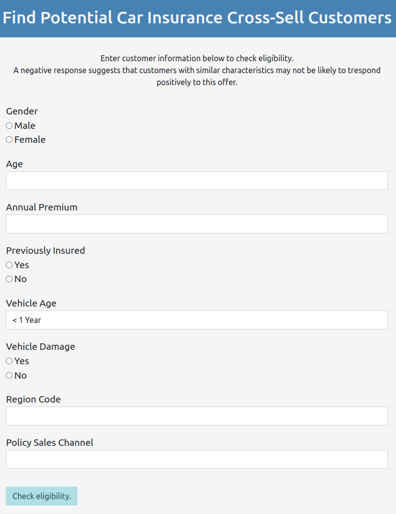
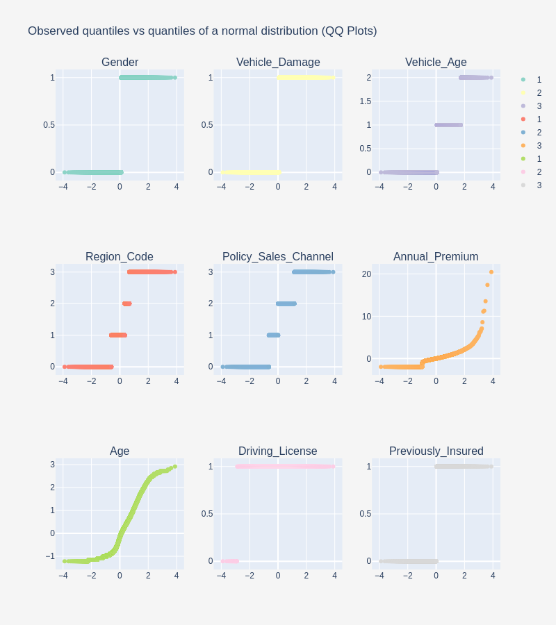
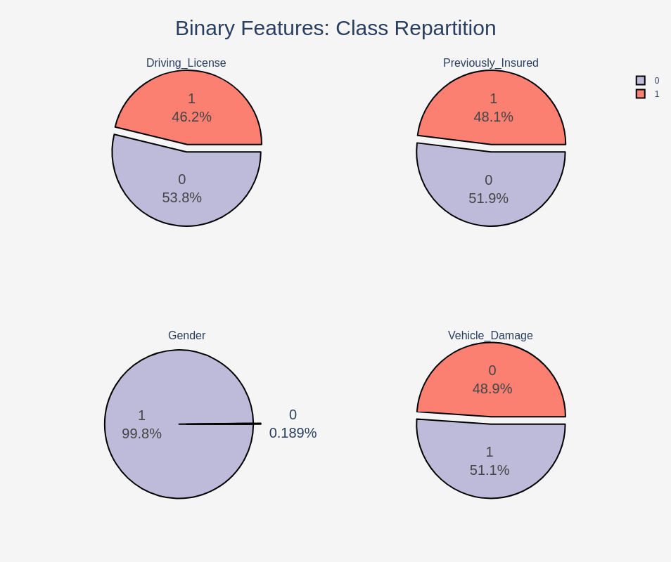
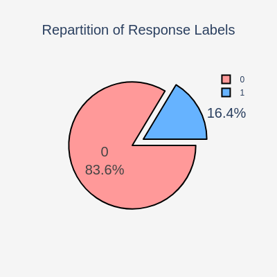
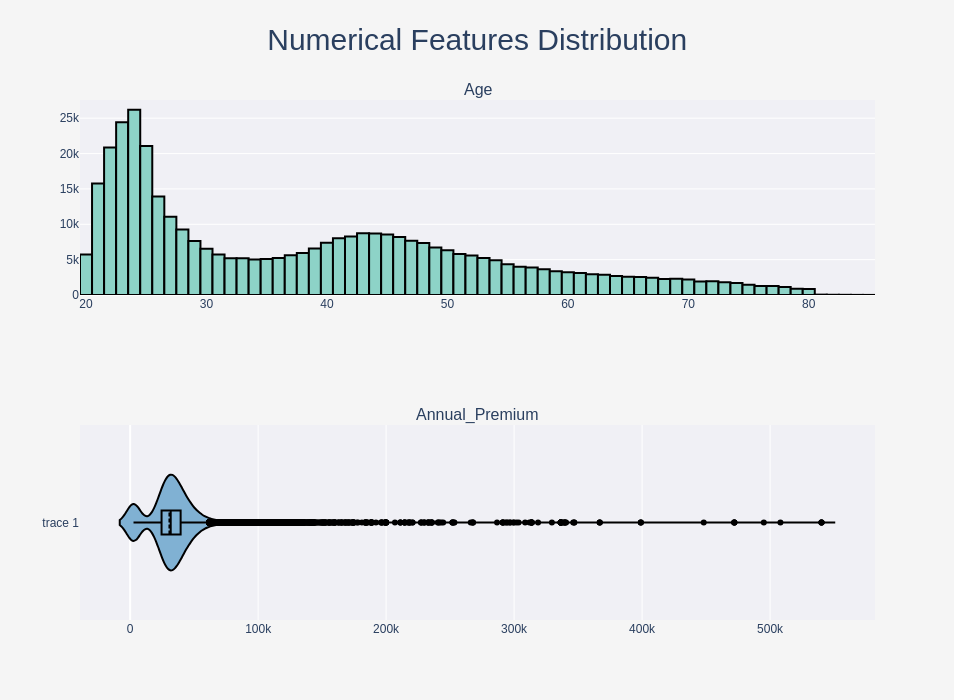
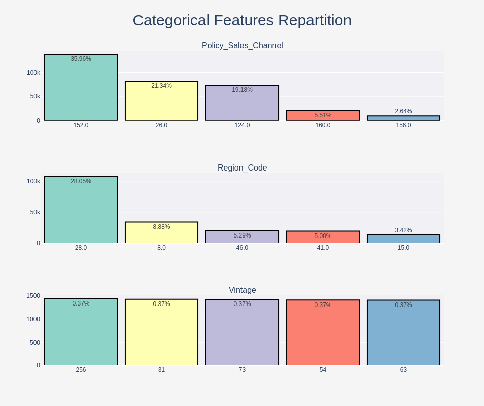
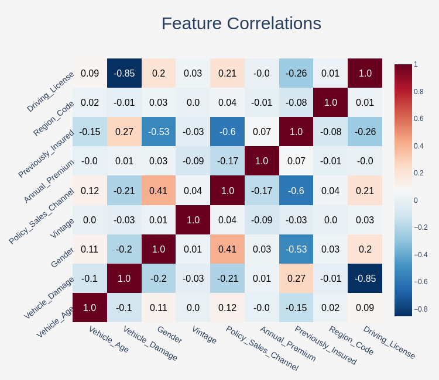
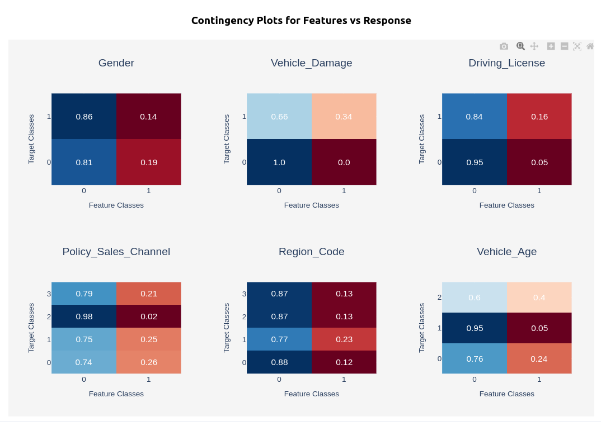

# **Insurance cross-selling potential prediction:**

## **Working on a dataset with imbalanced target classes**

## **Libraries**

* **Tabular**

  * **pandas**
  * **numpy**
* **Tools**

  * **joblib**: persistence
* **Visualization**

  * **plotly express / graphing objects**
  * **ipywidgets**: subplot container
* **Machine Learning**

  * **scikit-learn**: pipeline, models
  * **imbalanced-learn**:  resampling
  * **feature-engine**: transformers
* **API**

  * **flask**

## **Structure**

```text
.
├── app : API 
│   └── templates: html structure of the form page
├── bin: dataset downloader (requires Kaggle API key)
├── data: train / test + answer
├── models: ml models and pipelines
├── notebooks: exploration, evaluation
├── output: plots
├── src: pipeline builder, viz functions, etc
└── tests: api, result matches local / distant models

```


## **API**  

Run locally

```bash
export FLASK_APP=app/app.py

flask run -h 0.0.0.0 -p 5000
```


**API call example**

```bash
curl -X POST \
  -d "Gender=male" \
  -d "Vehicle_Damage=yes" \
  -d "Vehicle_Age=<1 Year" \
  -d "Region_Code=28" \
  -d "Policy_Sales_Channel=124" \
  -d "Annual_Premium=30000" \
  -d "Age=25" \
  -d "Previously_Insured=0" \
  http://localhost:5000/predict

```

**UI app**

```text
http://127.0.0.1:5000/predict
```





## **Viz**  




  

  

  

  

  


